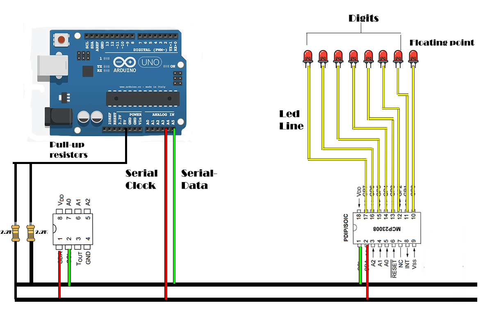

# Digital Thermometer

#### Bill of Materials:
- Arduino UNO
- DS1621 Temperature sensor
- MCP23008 IO Expander
- 2x 2.2k ohm resistors
- 8 LEDs

**Software used:** Microchip Studio

## Main Concepts
- Implement the `I2C Communication Protocol`
- Read the temperatuer from the `DS1621` IC
- Send the value to the `IO Expander` in order to display the value on the `LEDs`
- Send the temperature on the `Serial Monitor` formated as `xx.x C` (%d.%1u C)

### Circuit Overview


## I2C Protocol
- The I2C Protcol has to be able to both read and write to the connected `Slave Devices`
- The `Master Device` will send the `7-bit Address and the R/W bit`
- The corresponding `Slave Device` recieves the data and awaits the operation
- For writing, the data needs to be sent without an acknowledgement
- For reading, the data can be sent read two ways:
	- Data is recieved with an `acknowledge` bit at the end
	- Data is recieved with an `not-acknowledge` bit at the end
- The `Maste Device` can release and lock in the data bus on demand

Overview of the I2C Protocol
```C
#ifndef PROTOCOL_I2C_H_
#define PROTOCOL_I2C_H_

#define MAX_TRIES 50		//Limit for the communication tries
#define I2C_START 0			//I2C start signal
#define I2C_DATA 1			//I2C data without acknowledge signal
#define I2C_DATA_ACK 2		//I2C data with acknowledge signal
#define I2C_STOP 3			//I2C stop communication signal
#define ACK 1				//Acknowledge flag
#define NACK 0				//Not acknowledge flag
#define DATASIZE 32			//Max size of the data transfered through the data bus

#include <avr/io.h>
#include <util/delay.h>
#include <util/twi.h>

//Prepare the TWI register for communication
void i2c_init(void);
//Lock in the data bus and send the device address with the R/W bit
char i2c_start(unsigned int dev_id, unsigned int dev_addr, unsigned char rw_type);
//Write to the slave device
char i2c_write(char data);
//Release the data bus
void i2c_stop(void);
//Read the data from the slave device without acknowledge
unsigned char I2C_read_nack(void);
//Read the data from the slave device with acknowledge
unsigned char I2C_read_ack(void);
//transmit the data to the slave device
unsigned char i2c_transmit(unsigned char type);

#endif /* PROTOCOL_I2C_H_ */
```

## Unit Testing

*MCP23008 IO Expander*
- In order to tests the IO expander, I have created a simple circuit, connecting only the MCP23008 to the ArduinoUNO board and 8 LEDs, displaying a number and incrementing it.

```C
int main(void)
{
  int x = 0;
  i2c_init();                         // Initial Master I2C
	
  Write_MCP23008(IODIR, 0b00000000);  // Initial the MCP23008 GP0 to GP7 as Output
  Write_MCP23008(GPIO, 0b00000000);   // Reset all the Output Port

  while(1) 
  {
	  Write_MCP23008(GPIO, x++);  // Write to MCP23008 GPIO Register
	  _delay_ms(100);
  }
	
```

*DS1621 Temperature Sensor*
- Testing the DS1621 was pretty challenging as the payload is 2 bytes which have to be recieved in a different manner, requiring an `acknowledge tranfer` and a `not-acknowledge transfer`

Recieving the temperature:
```C
int16_t DS1621_getCTemp()
{
	uint8_t msb, lsb;				//Uint8_t used for storing a numerical value
	i2c_start(DS1621_ID, DS1621_ADDR, TW_WRITE);	//Take over the bus
	i2c_write(READ_TEMP);				//Send the temperature reading register
	i2c_start(DS1621_ID, DS1621_ADDR, TW_READ);	//Repeated start to keep the data bus
	msb = I2C_read_ack();				//Read the MSB with acknowledge
	lsb = I2C_read_nack();				//Get the LSB without acknowledge
	i2c_stop();					//Release the data bus

	int16_t temp = (int8_t) msb << 1 | (lsb >> 7);	//Get the full temperature by creating the data byte
	temp = temp * 5;				//Convert to tenth of Celsius degrees
	return temp;					//return the value
}
```
Sending the temperature to the Serial Monitor:

```C
int16_t temp = DS1621_getCTemp();		//Get the temperature
	  
char buffer[10];				//Buffer for the Serial monitor
snprintf(buffer, sizeof(buffer), "%u.%1uC\n", temp / 10, temp % 10); //Put the temperature in the buffer and format the text
for (int i = 0; i < strlen(buffer); i++) 
	USART_Transmit(buffer[i]);		//Send the buffer to the Serial Monitor
```

## Final System
- For the final system I have connected the components and tested to see if the registered temperature is displayed correctly on the `LEDs` and on the `Serial Monitor`.

```C
int main(void)
{
  USART_Init();			     // Initial Master I2C
  i2c_init();
  Write_MCP23008(IODIR,0b00000000);  //Initial the MCP23008 GP0 to GP7 as Output
  Write_MCP23008(GPIO,0b00000000);   //Reset all the Output Port
  DS1621_init();		     //Initialize the temperature sensor
  sei();			     //Enable global interrupts

  while(1) 
  {
	  int16_t temp = DS1621_getCTemp(); //Get the temperature
	  Write_MCP23008(GPIO, ((temp / 10) << 1) | ((temp % 10) / 5));	//Display the temperature on the 8 LEDs
	  
	  char buffer[10];		    //Buffer for the Serial monitor
	  snprintf(buffer, sizeof(buffer), "%u.%1uC\n", temp / 10, temp % 10); //Put the temperature in the buffer and format the text
	  for (int i = 0; i < strlen(buffer); i++) 
		  USART_Transmit(buffer[i]);//Send the buffer to the Serial Monitor
	  
	  _delay_ms(1000);		    //Delay for 1 sec.
  }
  
  return 0;
}
```
### Important
- The temperature on the LEDs is displayed as `powers of 2` and the first LED signals the `.5` of the temperature.
- In order to fit both the `integer-part` and the `fractional-part` of the temperature, the `integer-part` had to be shifted once.

## Final Result
- As a final result, I have managed to create a functional thermometer that displays the temperature on both LEDs and Serial Monitor
- This result can be potentially used to create a nice interface that can act as a nice home thermometer.
